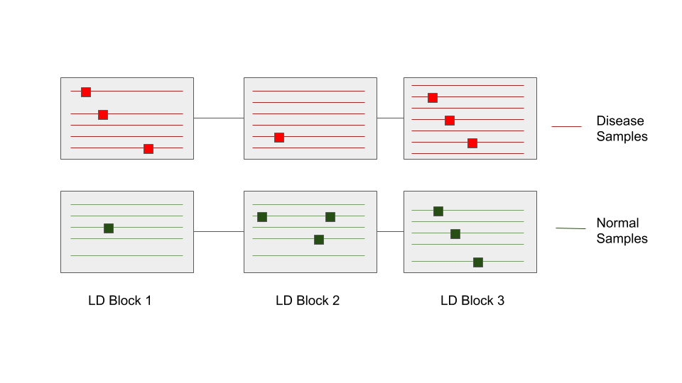
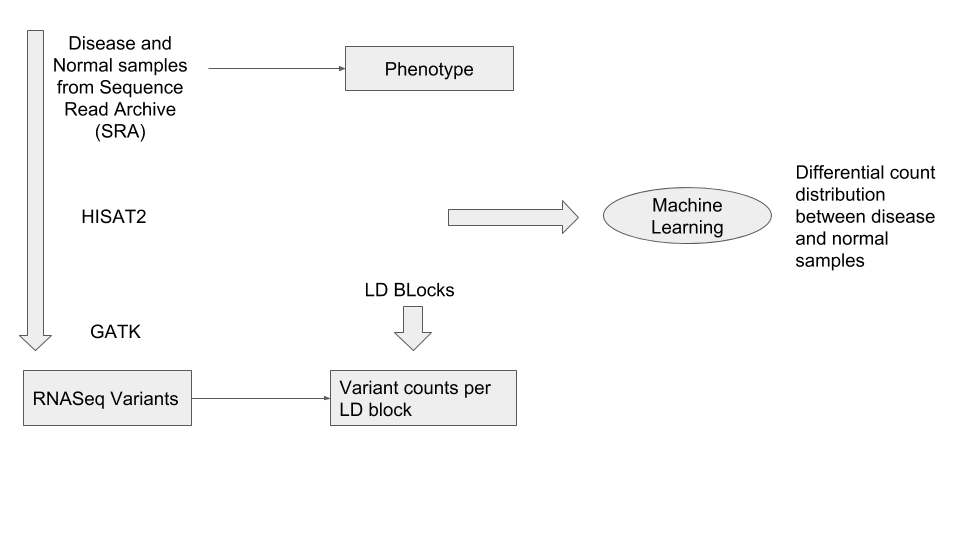
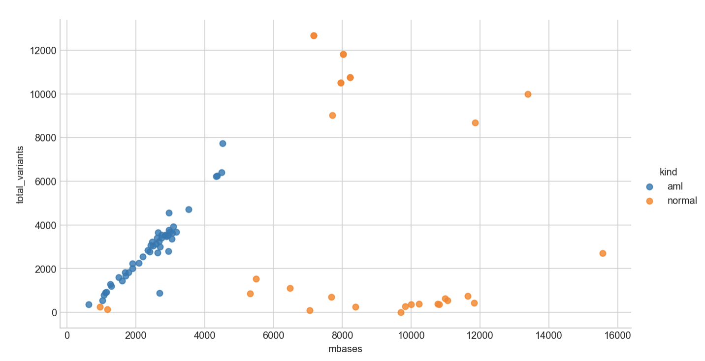

Association of **Hap**lotype blocks to phenotypes (in **Py**thon) using a neural **net**work machine learning method

A tool to test the association of variants in haplotype blocks to phenotypes.
This tool takes variants (VCF format) called by any technolgy like Exome, WGS, RNASeq or SNP Genotyping Arrays and generates association test results.

[Slides](https://docs.google.com/presentation/d/1mDAG509Ws1NSq7yGIEN6PMi6xeDpaBfiUjAW1mVI2QU/edit#slide=id.g36ae1cf8e4_0_38) from our presentation at [UCSC NCBI Hackathon](https://ncbiinsights.ncbi.nlm.nih.gov/2018/03/02/ncbi-ucsc-genomics-hackathon-april-2018/)

## Install
  1. Clone the repo
     * `git clone https://github.com/NCBI-Hackathons/HapPyNet.git`
  2. Install dependencies (varies depending on input)
     * Details [here](docs/README.md#requirements) and [here](docs/README.ML.md#requirements)
    
## Usage
   1. Generate SNP count matrix (Number of SNPs per LD block) \
      See README [here](docs/README.md#usage)
   2. Run a neural net to classify samples into disease vs. normal \
      See README [here](docs/README.ML.md#usage)

## Method
   * Call variants using any platform (RNASeq, Exome, Whole Genome or SNP Arrays)
   * Group variants by haplotype blocks to compute SNP load in each haplotype block
   * Classify samples into disease vs normal, based on SNP load(number of SNPs per LD block) using a TensorFlow classifier
   * Associate haplotypes with phenotype. As of Apr 2018, this is NOT implemented

## Data sources

   * LD Blocks : Non-overlapping LD blocks derived from 1KG data (hg19) were obtained from : *Approximately independent linkage disequilibrium blocks in human populations, Bioinformatics. 2016 Jan 15; 32(2): 283–285 [doi:  10.1093/bioinformatics/btv546](https://www.ncbi.nlm.nih.gov/pmc/articles/PMC4731402/)*. Using NCBI's online remapping tool these regions were mapped to GRCh38 with merge fragments turned ON to make sure each LD block is not fragmented

   * RNASeq samples: Initial training set from healthy and disease samples were obtained from SRA. The disease sample selection query was: `(AML) AND "Homo sapiens"[orgn:__txid9606] NOT ChIP-Seq`. List of SRR samples used are provided [here](test_data/SRR_lists)

## RNASeq Variant Calling Pipeline

   * RNASeq sample reads were aligned using [HiSat2](https://ccb.jhu.edu/software/hisat2/index.shtml)
   * Variants were called using [GATK version 4.0.3.0](https://github.com/broadinstitute/gatk/releases/download/4.0.3.0/gatk-4.0.3.0.zip)  and quality filtered at read depth of 50 and genotype quality of 90

## Machine Learning

   * We trained a classifier with a 4 layer NeuralNet using TensorFlow with leave-one-out cross validation.

   

## Results

   Our classifier model trained on our test AML and normal samples showed a 99% cross validated accuracy!

## Next steps
   * Rerun on a large set of samples, with demographics and batch controlled normals
   * Explore standard differential gene expression methods from Bioconductor
   * Explore other normalization methods for Haplotype length and number of SNPs in samples
