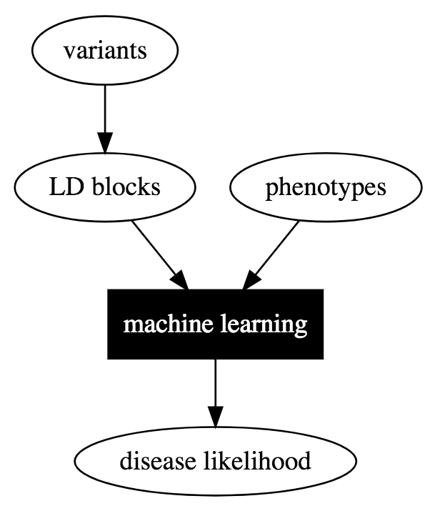

# HaploPhen

Association of haplotype blocks to phenotypes using machine learning methods

A tool to test the association of variants in haplotype blocks to phenotypes.
This tool takes variants called by any technolgy like Exome, WGS, RNASeq or SNPArrays in VCF format and generates association test results

## Usage

   * Step 1 : Generate SNP count matrix (Number of SNPs per LD block)
   python src/load_data.py [options] <SRA_id or vcf file>
   options: 
   -o outdir
   -i sample.vcf
   -s sample.sra
   -c 
   * Step 2 :

## Method
   * Call variants using any platform (RNASeq, Exome, Whole Genome or SNP Arrays)
   * Group variants by haplotype blocks to compute SNP load in each haplotype block
   * Associate haplotypes with phenotype ...

## Data sources

   * LD BLocks : Non-overlapping LD blocks derived from 1KG data (hg19) were obtained from : Approximately independent linkage disequilibrium blocks in human populations,Bioinformatics. 2016 Jan 15; 32(2): 283–285 [doi:  10.1093/bioinformatics/btv546]. Using NCBI's online remapping tool these regions over mapped to GRCh38 with merge fragments turned ON to make sure each LD block is not fragmented

   * RNASeq samples: Initial training set from healthy and disease samples were obtained from SRA. The disease sample selection query was: (AML) AND "Homo sapiens"[orgn:__txid9606] NOT ChIP-Seq. The healthy sample selection criteria was: ...

## RNASeq Variant Calling Pipeline

   * RNASeq sample reads were aligned using HiSat2
   * Variants were called using GATK version
   
## Association Tests

   * We are exploring standard differential gene expression methods from Bioconductor

